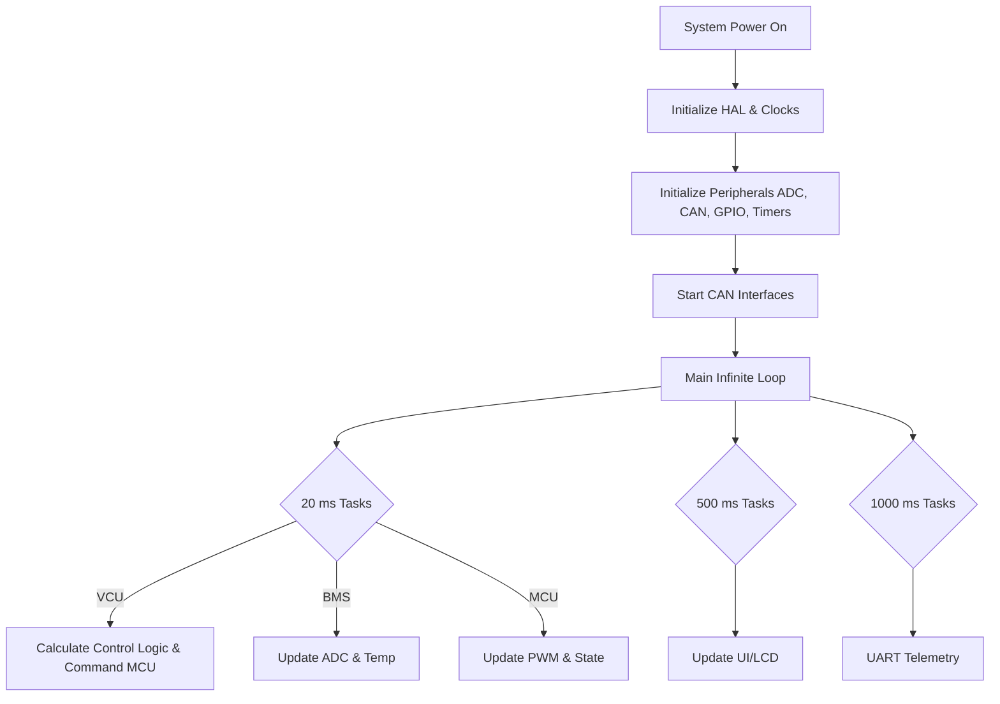
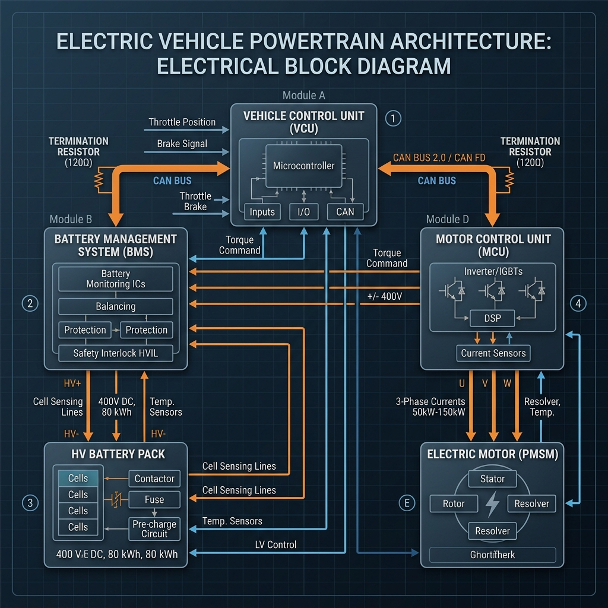

# EV Powertrain Control System

This repository contains the complete firmware for a bare-metal Electric Vehicle (EV) powertrain control system. The project is built using STM32CubeIDE and is divided into three primary electronic control units (ECUs): the Motor Control Unit (MCU), Battery Management System (BMS), and Vehicle Control Unit (VCU).

## Project Overview
This project provides the control software for a distributed powertrain system. 
- **VCU (Vehicle Control Unit):** The central master node that orchestrates vehicle behavior based on driver inputs.
- **BMS (Battery Management System):** The battery monitoring node that tracks voltage, current, temperature, State of Charge (SOC), and State of Health (SOH).
- **MCU (Motor Control Unit):** The motor drive node that commands motor PWM and tracks motor speed via Hall sensors based on VCU commands.

All ECUs communicate over a shared 500 kbit/s CAN bus to ensure synchronized, safe, and reliable vehicle operation.

## Project Structure
The repository is divided into distinct STM32CubeIDE workspaces and projects:

```
STM32CubeIDE/
├── MCU_WORKSPACE/
│   └── MCU_ECU/          # Motor Control Unit project
│       ├── Src/          # Motor control logic, PWM, Hall sensor processing
│       └── MCU_WORKSPACE.ioc # STM32CubeMX configuration for MCU
├── workspace_2.2.0/
│   ├── BMS_ECU/          # Battery Management System project
│   │   ├── Core/Src/     # SOC/SOH algorithms, battery ADC, CAN status
│   │   └── BMS_ECU.ioc   # STM32CubeMX configuration for BMS
│   ├── VCU_ECU/          # Vehicle Control Unit project
│   │   ├── Src/          # Master state machine, driver inputs, fault manager
│   │   └── VCU_ECU.ioc   # STM32CubeMX configuration for VCU
│   └── VCE_ECU/          # (Unused/Deprecated placeholder)
└── VCU_WORKSPACE/        # (Unused/Deprecated artifact directory)
```
*Note: Ensure you open the correct `.project` files within the `MCU_ECU`, `BMS_ECU`, and `VCU_ECU` directories when using STM32CubeIDE.*

## System Architecture
The system employs a distributed, master-slave architecture. 
1. The **VCU** is the master. It reads physical switches and throttles, calculates desired states, and commands the MCU.
2. The **BMS** constantly monitors battery health and broadcasts its status over CAN. If the BMS reports a fault, the VCU intercepts it and gracefully shuts down the system.
3. The **MCU** acts as the slave to the VCU. It translates VCU command percentages into physical motor PWM signals, computes motor speed, and reports its status back to the VCU.

### Software Execution Workflow
None of the ECUs rely on an RTOS. They utilize a cooperative time-sliced scheduler based on the `HAL_GetTick()` system timer.



## Hardware and Circuit Diagrams
Below is the conceptual electrical block diagram of the EV powertrain architecture, illustrating the connections between the VCU, MCU, BMS, and their respective high-voltage components.



## Inputs and Outputs (Hardware Interfaces)
All microcontrollers are configured as `STM32F103C8T6`. Below are the verified pin configurations:

### VCU (Vehicle Control Unit)
| Pin | Function / Label | Type | Description |
|-----|------------------|------|-------------|
| PA0 | ADCx_IN0 | Analog | Throttle / Accelerator input |
| PA1 | ADCx_IN1 | Analog | Brake input |
| PA9/PA10 | USART1 TX/RX | Serial | Debug / Telemetry output |
| PA11/PA12| CAN_RX / CAN_TX | CAN | Communication bus |
| PB0 | VCU_STATUS_LED | Output | System status indicator |
| PB1 | VCU_FAULT_LED | Output | System fault indicator |
| PB8 | MOTOR_ENABLE | Output | Hardware enable line to MCU |
| PB9 | CONTACTOR_ENABLE | Output | Main HV contactor control |
| PB10..13| GPIO_Input | Input | Various physical switches (Direction, etc.) |

### BMS (Battery Management System)
| Pin | Function / Label | Type | Description |
|-----|------------------|------|-------------|
| PA0 | ADCx_IN0 | Analog | Battery Voltage Sensing |
| PA1 | ADCx_IN1 | Analog | Battery Current Sensing |
| PA2 | ADCx_IN2 | Analog | Battery Temperature Sensing |
| PA11/PA12| CAN_RX / CAN_TX | CAN | Communication bus |
| PB0 | BMS_STATUS_LED | Output | BMS status indicator |
| PB1 | BMS_FAULT_LED | Output | BMS fault indicator |

### MCU (Motor Control Unit)
| Pin | Function / Label | Type | Description |
|-----|------------------|------|-------------|
| PA0 | S_TIM2_CH1_ETR | Input Capture | Hall sensor input (RPM calculation) |
| PA1 | ADCx_IN1 | Analog | Motor local analog input |
| PA8 | S_TIM1_CH1 | PWM Output | Motor PWM drive signal |
| PA11/PA12| CAN_RX / CAN_TX | CAN | Communication bus |
| PB0/PB1 | MOTOR_AIN1 / AIN2| Output | Motor direction / bridge control |
| PB2 | MOTOR_STBY | Output | Motor standby / sleep line |
| PB10..13| START/STOP/FWD/REV | Input (PullUp) | Local motor override buttons |
| PB14| BUZZER | Output | Local audible alert |

## Communication Protocols
The ECUs interact over a **500 kbit/s CAN bus** with standard 11-bit identifiers.

| CAN ID | Transmitter | Receiver | Purpose | Payload |
|--------|-------------|----------|---------|---------|
| `0x100` | BMS | VCU | BMS Status | Voltage, Current, Temp, SOC, SOH, Faults |
| `0x300` | VCU | MCU | VCU Command | Direction, PWM %, Enable, State req, Counter |
| `0x301` | MCU | VCU | MCU Status | RPM, Current, Temp, State, Faults, Direction |
| `0x310` | MCU | Any | MCU Heartbeat | TX Counter, State, Fault, Enable |

## Safety and Error Handling
Safety is a primary design constraint for the firmware:
- **CAN Supervision:** The VCU strictly monitors MCU and BMS status timestamps. If an ECU stops transmitting (timeout), the VCU safely transitions to a fault state and cuts the motor enable signal.
- **Initialization Failure:** If the STM32 HAL fails to configure the system clocks or CAN bus at startup, the system traps into an infinite loop `Error_Handler()` that statically turns off all safety-critical GPIOs (e.g., `CONTACTOR_ENABLE`, `MOTOR_STBY`).
- **Data Validation:** Incoming CAN frames are verified for length and data limits. For example, command PWM is clamped and direction parameters are checked against valid enumerations before actuation.

## Build and Setup Instructions
1. **Prerequisites:** Install [STM32CubeIDE](https://www.st.com/en/development-tools/stm32cubeide.html).
2. **Importing:** 
   - Open STM32CubeIDE and select an empty workspace.
   - Go to `File -> Import -> General -> Existing Projects into Workspace`.
   - Browse to `MCU_WORKSPACE/` to import the MCU project. Repeat for `workspace_2.2.0/` to import BMS and VCU.
3. **Building:** Select a project in the Project Explorer and click the "Hammer" icon (`Project -> Build Project`).
4. **Flashing:** Connect your ST-Link to the SWDIO (PA13) and SWCLK (PA14) pins of the STM32. Click the "Bug" icon to Debug or "Play" to Run.

## Limitations and Future Improvements
- **Missing Hardware Sensors:** As noted in the MCU firmware comments, local motor current and motor temperature sensing are omitted in the current hardware revision. The MCU transmits these values as `0` over CAN.
- **Heartbeat Implementation:** While the MCU broadcasts a heartbeat (`0x310`), the VCU firmware notes that "VCU heartbeat reception is not yet implemented". This could be improved to offer bi-directional heartbeat monitoring.
- **Cleanup Needed:** The root folder contains `VCU_WORKSPACE` and `VCE_ECU` which appear to be unused skeleton folders with only `.metadata` inside.
